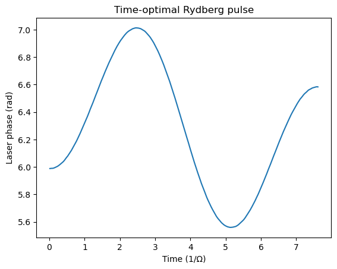
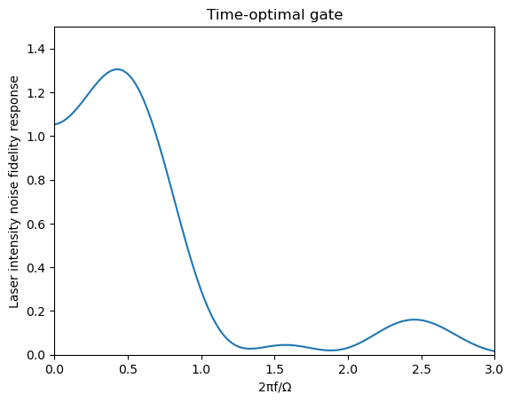
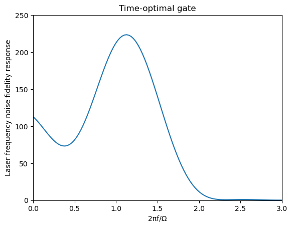
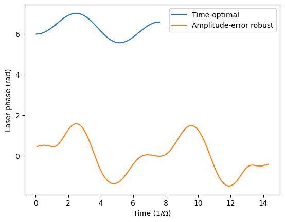
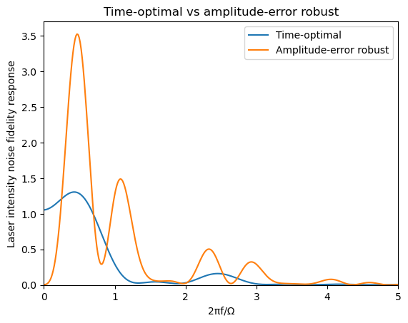
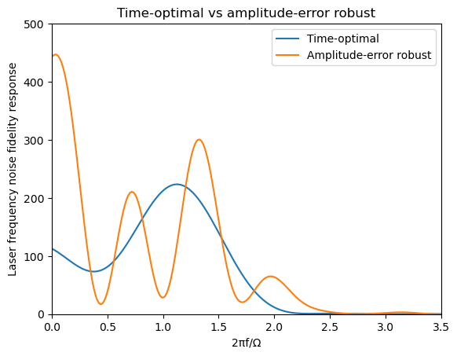

# Quick start and example

## Time-Optimal CZ Gate

This example demonstrates how to compute the time-optimal quantum CZ gate in a two-atom symmetric blockaded Rydberg system, following the [work by Jandura and Pupillo](https://quantum-journal.org/papers/q-2022-05-13-712/).

This example can be found in `RobustGRAPE/examples/time_optimal_cz.jl`.

### Problem Setup and Optimization

Before we define the problem computationally, a short explanation is required about the interfaces offered by the package to represent a GRAPE problem with robustness. The complete documentation can be found [here](api/types.md).

We define a GRAPE problem as a Hamiltonian `H0`, a target unitary `U0`, a (pseudo)-projector on the computational subspace `P`, and a set of error sources (which can be empty). We leave aside errors for now and consider an ideal error-free scenario.

`H0` and `U0` may depend on control parameters, which are separated in a set of _main_ parameters and a set of _additional_ parameters. Main parameters may only affect `H0` at a given time, while additional parameters can affect `H0` at any time, as well as `U0`. For instance, for the Rydberg system we're considering in this example, the phase ``\phi(t)`` is a main parameter, while ``\theta``, the single-qubit phase in the target unitary, is an additional parameter.

We represent all the parameters in a single vector in the following way:

```math
x = (x_1 (t_1), x_2 (t_1), \dots, x_k (t_1), x_1 (t_2), \dots, x_k (t_n), x^{(a)}_1, \dots, x^{(a)}_l)
```

where ``t_i = t_{\mathrm{tot}} \times (i/n)``, ``k`` is the number of main parameters, and ``l`` is the number of additional parameters.

Therefore, our problem interface includes a Hamiltonian function that has for signature `H(t::Real,x::Vector{<:Real},x_add::Vector{<:Real}) = some matrix`, where `t` is the time, `x` is the vector of main parameters at time `t`, and `x_add` is the vector of any additional parameters. We also need to define a target unitary function `target_unitary(x_add) = some matrix`.

In this example, we work with the two-atom symmetric blockaded Rydberg Hamiltonian, expressed in the ``|00\rangle, |01\rangle, |11\rangle, |0r\rangle, |W\rangle`` symmetric blockaded basis where ``|W\rangle = (|1r\rangle + |r1\rangle)/\sqrt{2}``.

```math
H = 
\begin{pmatrix}
0 & 0 & 0 & 0 & 0 \\
0 & 0 & 0 & \frac{(1+\epsilon)e^{-i\phi}}{2} & 0 \\
0 & 0 & 0 & 0 & \frac{(1+\epsilon)e^{-i\phi}}{\sqrt{2}} \\
0 & \frac{(1+\epsilon)e^{i\phi}}{2} & 0 & \delta & 0 \\
0 & 0 & \frac{(1+\epsilon)e^{i\phi}}{\sqrt{2}} & 0 & \delta
\end{pmatrix}
```

In the Rydberg basis, our target unitary is a parametrized CZ gate, defined as a CZ gate composed with a single-qubit ``\theta``-phase gate on each qubit:

```math
U = 
\begin{pmatrix}
1 & 0 & 0 & 0 & 0 \\
0 & e^{i\theta} & 0 & 0 & 0 \\
0 & 0 & e^{i(2\theta+\pi)} & 0 & 0 \\
0 & 0 & 0 & 0 & 0 \\
0 & 0 & 0 & 0 & 0
\end{pmatrix}
```

We define these quantities computationally using the pre-defined functions in [Rydberg Tools](api/rydberg.md).

```julia
using RobustGRAPE
using RobustGRAPE.RydbergTools
using LinearAlgebra
using Optim
using Random
using Setfield

# Set random seed for reproducibility
Random.seed!(43)

# Define optimization parameters
ntimes = 500  # Number of time steps
t0 = 7.613    # Total evolution time (in units of 1/Ω)

# Define Hamiltonian and target operation
# Hamiltonian function takes time t, control parameter ϕ and additional parameters
H0(t, ϕ, x_add) = rydberg_hamiltonian_symmetric_blockaded(ϕ[1], 0, 0)

# Target operation (CZ gate) with an additional phase parameter
cz(x_add) = cz_with_1q_phase_symmetric(x_add[1])
```

Here, `rydberg_hamiltonian_symmetric_blockaded` represents the above Hamiltonian. We set the intensity and detuning errors (respectively, ``\epsilon`` and ``\delta``) to zero.

To define our robust GRAPE problem, we also need to set a (pseudo)-projector, which is used to define the computational subspace on which the average fidelity is averaged. It needs to be a diagonal matrix. The algorithm will decompose this projector into ``P = P_0 \times W`` where ``P_0`` is the projector with only ones and zeros on the diagonal, and ``W`` is a diagonal matrix that will be used to weight the trace: ``A \mapsto tr(W A)``. This is relevant for systems with symmetries such that the fidelity has to be averaged with weighting specific states to account for the symmetry. For instance, in the Rydberg example we're considering, we consider a simplified Hilbert space ``|00\rangle, |01\rangle, |11\rangle, |0r\rangle, |W\rangle``. Therefore the effective trace needs to account twice for the ``|01\rangle`` state. Hence we define the pseudo-projector:

```math
P = \mathrm{diag}(1,2,1,0,0)
```

With this in mind, we can define our problem:

```julia
# Create the optimization problem
rydberg_problem = FidelityRobustGRAPEProblem(
    UnitaryRobustGRAPEProblem(
        t0=t0,             # Total evolution time
        ntimes=ntimes,     # Number of time steps
        ndim=5,            # Dimension of the Hilbert space (5 for the Rydberg system)
        H0=H0,             # Hamiltonian function
        nb_additional_param=1,  # One additional parameter (phase)
        error_sources=[]   # No error sources for basic optimization
    ),
    collect(Diagonal([1, 2, 1, 0, 0])),  # Target state projection (computational subspace)
    cz                          # Target operation
)
```

Then we can define our optimization problem. Note that it would be relatively straightforward to directly use the interface we just created with the `calculate_fidelity_and_derivatives` to find the time-optimal gate. Nevertheless, the package offers a higher-level interface to perform this optimization more conveniently.

This interface minimizes a cost function:

```math
C = 1-F + c_1 \left( \frac{\partial^2 F}{\partial \epsilon_1^2} \right)^2 + \cdots + c_{n_e} \left( \frac{\partial^2 F}{\partial \epsilon_{n_e}^2} \right)^2 + r^{(1)}_1 R^{(1)}_1 + \cdots r^{(1)}_k R^{(1)}_k + r^{(2)}_1 R^{(2)}_1 + \cdots r^{(2)}_k R^{(2)}_k
```

where ``F`` is the average gate fidelity, ``\frac{\partial^2 F}{\partial \epsilon_i^2}`` is the sensitivity to an error ``\epsilon_i``, ``R^{(1)}_j`` and ``R^{(2)}_j`` are first- and second-order regularization functions that can be defined by the user for each set of main control parameters. This helps achieve a smoother pulse and can promote better convergence.

In this example, we don't consider any type of error, and we have a single main parameter ``\phi(t)``.

For convenience, simple regularization functions are defined in [Regularization](api/regularization.md). Here we use the `regularization_cost_phase` which is adapted for a phase parameter.

Additional parameters can be passed to the `Optim.optim` solver through the `additional_parameters` field. The list of configurable opttions for the solver can be found [here](https://julianlsolvers.github.io/Optim.jl/v0.9.3/user/config/).

```julia
# Configure optimization parameters
rydberg_cz_parameters = FidelityRobustGRAPEParameters(
    # Initial control pulse: small random values for the time steps + random phase
    x_initial = [2*π*0.001*rand(ntimes); 2*π*rand()],
    
    # Use phase regularization to ensure smooth pulses
    regularization_functions = [regularization_cost_phase],
    regularization_coeff1=[1e-7],  # First derivative regularization weight
    regularization_coeff2=[1e-7],  # Second derivative regularization weight
    
    error_source_coeff=Vector{Real}(),  # No error sources yet
    time_limit=40,  # Maximum optimization time in seconds
    
    # Additional parameters for the optimizer
    additional_parameters = Dict(
        :show_trace => true,    # Show optimization progress
        :show_every => 10,      # Display every 10 iterations
        :g_tol => 1e-9          # Gradient tolerance for convergence
    )
)
```

Finally, we run the optimization:

```julia
# Run optimization
res_optim_cz = optimize_fidelity_and_error_sources(rydberg_problem, rydberg_cz_parameters)

# Extract optimized pulse
optim_pulse = Optim.minimizer(res_optim_cz)

# Evaluate the final fidelity
final_fidelity, _, _, _ = calculate_fidelity_and_derivatives(rydberg_problem, optim_pulse)
println("Final fidelity: $(final_fidelity)")
```

### Visualizing the Optimized Pulse

We can visualize the optimized pulse using PyPlot:

```julia
using PyPlot

# Plot the phase profile
fig, ax = subplots()
# Use unwrap_phase to ensure smooth phase representation
ax.plot((1:ntimes) / ntimes * t0, unwrap_phase(optim_pulse[1:ntimes]))
ax.set_title("Time-optimal Rydberg pulse")
ax.set_xlabel("Time (1/Ω)")
ax.set_ylabel("Laser phase (rad)")
```



## Analyzing the time-optimal gate's error sensitivity

A key feature of RobustGRAPE is the ability to analyze and optimize control pulses for robustness against various sources of noise and experimental imperfections. This example demonstrates how to evaluate the sensitivity of an optimized quantum gate to common error sources.

### Defining Error Hamiltonians

The total system Hamiltonian has to be decomposed into:

```math
H(t) = H_0(t) + H_1(\epsilon_1) + \cdots + H_{n_e}(\epsilon_{n_e})
```

where ``H_i(0) = 0``, and ``H_i(\epsilon_i)`` represents the additional Hamiltonian due to some error ``\epsilon_i``. One may also define a _noise operator_ ``O_i = \frac{\partial H_i}{\partial \epsilon_i} (0)``.

These Hamiltonians ``H_i`` can be used to define an error source `ErrorSource(Herr)` with `Herr(t,x,x_add,eps) = some matrix`. Here we first consider two types of error: amplitude errors on the laser drive (parametrized by `\epsilon`) and angular frequency errors between the ground state manifold and the Rydberg manifold (parametrized by ``\delta``). Note that, because we consider a symmetric system, these errors apply to both atoms at the same time. Hence, the frequency errors cannot represent uncorrelated errors due to, e.g., Doppler-induced dephasing.

Let's define these Hamiltonians and we alter our `FidelityRobustGRAPEProblem` to include these error sources.

```julia
# Define error Hamiltonians as deviations from the ideal Hamiltonian

# amplitude error: variation in the Rabi frequency (laser power)
H_amplitude_error(t, ϕ, x_add, ϵ) = rydberg_hamiltonian_symmetric_blockaded(ϕ[1], ϵ, 0) - H0(t, ϕ, x_add)

# Frequency error: variation in the laser detuning
H_frequency_error(t, ϕ, x_add, δ) = rydberg_hamiltonian_symmetric_blockaded(ϕ[1], 0, δ) - H0(t, ϕ, x_add)

rydberg_problem_with_errors = (@set rydberg_problem.unitary_problem.error_sources = [
    ErrorSource(H_amplitude_error),
    ErrorSource(H_frequency_error)
])
```


### Static error sensitivity

Now we can analyze how sensitive our previously optimized pulse is to a static error induced by these noise sources, by computing ``\frac{\partial^2 F}{\partial \epsilon_i^2}``. Later on, we will demonstrate how to include this sensitivity to the optimization procedure.

```julia
# Analyze sensitivity to errors with previously optimized pulse
F, _, F_d2err, _ = calculate_fidelity_and_derivatives(rydberg_problem_with_errors, optim_pulse)

# The F_d2err vector contains the second derivatives of fidelity with respect to error parameters
# These values tell us how quickly the fidelity decreases with small errors

println("Infidelity: $(1-F)")
println("Sensitivity to amplitude errors: F = 1 - $(-F_d2err[1]/2) × ϵ²")
println("Sensitivity to frequency errors: F = 1 - $(-F_d2err[2]/2) × δ²")

# Returns
# Infidelity: 1.3855583347321954e-13
# Sensitivity to amplitude errors: F = 1 - 4.211625822890814 × ϵ²
# Sensitivity to frequency errors: F = 1 - 2.8602011006871577 × δ²
```


### Computing the fidelity response function

In AMO physics, it is common to encounter systems whose noise is parametrized by a classical process described by a power spectral density. In [this work](https://journals.aps.org/prxquantum/abstract/10.1103/PRXQuantum.6.010331), it was shown that the fidelity sensitivity to such noise processes can be efficiently described by a frequency-domain fidelity response function. This generalizes the static sensitivity generalized earlier (notably, if we note ``I(f)`` this function, then we have ``I(0) = -\frac{1}{2} \frac{\partial^2 F}{\partial \epsilon^2}``).

Eq (8) in the reference above shows how the expected fidelity can be simply obtained from knowing the response function and the noise process (e.g. laser intensity) PSD. This package provides an efficient way to compute the response function:

```julia
# Calculate frequency response with oversampling for better resolution
response_fct, frequencies = calculate_fidelity_response_fft(
    rydberg_problem_with_errors, 
    optim_pulse; 
    oversampling=30  # Higher values provide smoother frequency resolution
)

# Verify that DC component matches our direct calculation
# The DC component (zero frequency) corresponds to static parameter shifts
@assert isapprox(-F_d2err[1], 2*response_fct[1,1], rtol=1e-3, atol=1e-3)
@assert isapprox(-F_d2err[2], 2*response_fct[1,2], rtol=1e-3, atol=1e-3)
```

The `calculate_fidelity_response_fft` function computes how the gate fidelity responds to time-dependent noise at different frequencies. The returned matrices contain:
- `response_fct`: A matrix of size `(ntimes*oversampling,nerr)`
- `frequencies`: The corresponding frequency values (in units of Ω/2π) with size `ntimes*oversampling`.


Let's plot the response to intensity noise and frequency noise.
Note that we apply a scaling factor to both such that we match usual conventions:
- ``(1/2)^2`` for the intensity noise because our Hamiltonian is written as a function of amplitude deviation
- ``(2\pi)^2`` for the frequency noise because our Hamiltonian is written as a function of angular frequency deviation.

```julia
using PyPlot
fig, ax = subplots()
ax.plot(frequencies, 0.25 * response_fct[:,1])
ax.set_xlim(0, 3)
ax.set_ylim(0, 1.5)
ax.set_xlabel("2πf/Ω")
ax.set_ylabel("Laser intensity noise fidelity response")
ax.set_title("Time-optimal gate response to intensity noise")
```



```julia
fig, ax = subplots()
ax.plot(frequencies, (2*π)^2 * response_fct[:,2])
ax.set_xlim(0, 3)
ax.set_ylim(0, 250)
ax.set_xlabel("2πf/Ω")
ax.set_ylabel("Laser frequency noise fidelity response")
ax.set_title("Time-optimal gate response to frequency noise")
```




### Rydberg decay sensitivity


To evaluate the sensitivity to the decay of the Rydberg states we can calculate the integrated Rydberg state population during gate execution:

```julia
# Define an operator that detects population in Rydberg states
# The [0,0,0,1,1] pattern targets the Rydberg states in our 5-level system
decay_operator(t, x, x_add, ϵ) = ϵ*collect(Diagonal([0, 0, 0, 1, 1]))

# Update the problem to use this detection operator
rydberg_problem_with_decay = (@set rydberg_problem_with_decay.unitary_problem.error_sources = [
    ErrorSource(decay_operator)
])

# Calculate expectation values throughout the gate evolution
# The result is a matrix of values for each time step and each error source
rydberg_pops = calculate_expectation_values(rydberg_problem_with_decay, optim_pulse)

# Extract the final integrated Rydberg population (first error source, end of evolution)
rydberg_pop = rydberg_pops[end, 1]
println("Integrated Rydberg population: $(rydberg_pop)/Ω")
# Returns:
# Integrated Rydberg population: 2.963973401634995/Ω
```

The integrated Rydberg population is a dimensionless quantity that, when multiplied by the decay rate, gives the total probability of decay during the gate operation. Lower values indicate a more resilient gate against decoherence.

## Amplitude-Error Robust CZ Gate

RobustGRAPE allows us to design pulses that are resilient to specific types of errors by including the error sensitivity in the optimization cost function. Here we show how to obtain the (approximate) amplitude-error resilient pulse derived in this [work](https://link.aps.org/doi/10.1103/PRXQuantum.4.020336) for a total gate time ``T \approx 14.32/\Omega``.

The full working example is available in the `RobustGRAPE/examples/ar_cz.jl` notebook.

### Setting up the robust optimization

To design an amplitude-error robust gate, we include the amplitude error source in our problem definition and set a non-zero coefficient for the error sensitivity term in the cost function:

```julia
# Reduce the number of time steps for faster calculation
ntimes = 150
# Define the problem with amplitude error
rydberg_problem_ar = (@set rydberg_problem.unitary_problem.error_sources = [
    ErrorSource(H_amplitude_error)
])
# Use a longer evolution time for improved robustness
rydberg_problem_ar = (@set rydberg_problem_ar.unitary_problem.t0 = 14.32)

# Configure parameters for robust optimization
rydberg_cz_parameters_ar = (@set rydberg_cz_parameters.error_source_coeff = [1e-4])
rydberg_cz_parameters_ar = (@set rydberg_cz_parameters_ar.time_limit = 300)
rydberg_cz_parameters_ar = (@set rydberg_cz_parameters_ar.regularization_coeff1 = [1e-6])
rydberg_cz_parameters_ar = (@set rydberg_cz_parameters_ar.regularization_coeff2 = [1e-6])

# Run optimization
res_optim_cz_ar = optimize_fidelity_and_error_sources(rydberg_problem_ar, rydberg_cz_parameters_ar)
optim_pulse_ar = Optim.minimizer(res_optim_cz_ar)
```

Note that we increase the regularization coefficients as we find that it helps achieve better convergence when including error robustness in the optimization.

### Comparing time-optimal and robust pulses

The phase profiles of the time-optimal and amplitude-robust gates differ significantly:

```julia
fig, ax = subplots()
ax.plot((1:ntimes) / ntimes * t0_to, unwrap_phase(optim_pulse[1:ntimes]), label="Time-optimal")
ax.plot((1:ntimes) / ntimes * t0_ar, unwrap_phase(optim_pulse_ar[1:ntimes]), label="Amplitude-error robust")
ax.set_xlabel("Time (1/Ω)")
ax.set_ylabel("Laser phase (rad)")
ax.legend()
```



### Comparing error sensitivities and frequency responses

We can directly compare the sensitivity of both gates to various error sources:

```julia
# Create problem definitions with both error sources for comparison
rydberg_problem_with_errors = (@set rydberg_problem.unitary_problem.error_sources = [
    ErrorSource(H_amplitude_error),
    ErrorSource(H_frequency_error)
])

rydberg_problem_with_errors_ar = (@set rydberg_problem_ar.unitary_problem.error_sources = [
    ErrorSource(H_amplitude_error),
    ErrorSource(H_frequency_error)
])

# Calculate frequency response for both gates
response_fct, frequencies = calculate_fidelity_response_fft(rydberg_problem_with_errors,optim_pulse; oversampling=30)
response_fct_ar, frequencies_ar = calculate_fidelity_response_fft(rydberg_problem_with_errors_ar,optim_pulse_ar; oversampling=30)

# Compare Rydberg state population (relevant for decay)
rydberg_pop = calculate_expectation_values(rydberg_problem_with_decay, optim_pulse)[end,1]
rydberg_pop_ar = calculate_expectation_values(rydberg_problem_with_decay_ar, optim_pulse_ar)[end,1]
println("Time-optimal gate")
println("Integrated Rydberg population: $(rydberg_pop)/Ω")

println("\nAmplitude-error robust gate")
println("Integrated Rydberg population: $(rydberg_pop_ar)/Ω")

# Returns:
# Time-optimal gate
# Integrated Rydberg population: 2.963781384493184/Ω

# Amplitude-error robust gate
# Integrated Rydberg population: 5.198968153640445/Ω
```

The robust gate shows dramatically improved resilience against static amplitude errors compared to the time-optimal gate. This resilience comes with a steep trade-off in terms of sensitivity to dynamic intensity noise and to frequency noise, as well as increased gate duration and integrated Rydberg population:



